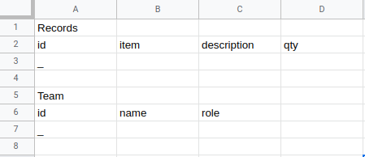
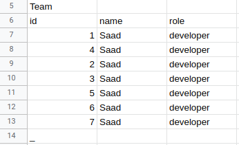

> Reduce and simplify business logic by accessing Google Sheet tables as object models

## Prerequisite
- Files in dist folder in the order mentioned in .clasp.json need to be in the Apps Script project of Google Sheets.
- Replace contents of appsscript.json with the one in this repo. By default  appsscript.json is hidden, can be set to visible from "Project Settings"
- Add schema tables to a sheet manually as in [this sheet](https://docs.google.com/spreadsheets/d/1h__nE6vpOQXwsTZqeGu_jUEDcnhI2tzj9tOJ3uoBI7E/edit?usp=sharing)
- Set Schema tables sheet id in apps script file "dist/framework.gs"
`shids.schema = <schema tables sheet id>`

### Insert Tables
Highlight table name and header row and run macro "macroInsertNewTable"


## Adding data

```
  const [sheet] = loader([1550146239])
  const models = ST.models
  // add data to table top
  models['Team'].addFirst({ id : 1,  name : "Saad", role : "developer" })
  models['Team'].addLast({ id : 2,  name : "Saad", role : "developer" })

  models['Team'].filter({ id : 2 }).addBelow({ id : 3,  name : "Saad", role : "developer" })
  models['Team'].filter({ id : 2 }).addAbove({ id : 4,  name : "Saad", role : "developer" })

  // add methods also accept multiple row objects for example
  models['Team'].addLast([
    { id : 5,  name : "Saad", role : "developer"} ,
    { id : 6,  name : "Saad", role : "developer"} ,
    { id : 7,  name : "Saad", role : "developer"} 
  ])

  // write to table
  models['Team'].table.commit()

```


## Filtering

```
// set model to point at all values
models['Team'].all()
// get values
let values = models['Team'].value

// filter functions return false if data is not found otherwise returns model object
// values are then accessed with model's 'value' property
models['Team'].filter({ name : "Saad", id : 3 })
values = models['Team'].value

// other filter functions
models['Team'].or({ name : "Saad", id : 3 })
models['Team'].and({ name : "Saad", id : 3 })
models['Team'].not({ name : "Saad", id : 3 })
models['Team'].nand({ name : "Saad", id : 3 }) // NAND logic
models['Team'].nor({ name : "Saad", id : 3 }) // NOR logic
models['Team'].greater({ id : 3 })
models['Team'].less({ id : 3 })

// 'and', 'or', 'not', 'nand' and 'nor' filter functions can also take arrays for example
// the expression below translates to: name = 'Saad' or (id = 3 or id = 4)
models['Team'].or({ name : "Saad", id : [3, 4] })
// similary the expression below translates to: name = 'Saad' and (id = 3 or id = 4)
models['Team'].and({ name : "Saad", id : [3, 4] })

// 'greater' and 'less' functions take a second argument 'equal' of type 'bool'
// to differentiate between operators '>' and '>=' and '<' and '<=' for example
// the below expression translates to: id >= 3
models['Team'].greater({ id : 3 }, true)

```

## Updating
```
// set name to "Khan" for all rows with id greater than 3
models['Team'].greater({ id : 3 }, true).set({ name : "Khan" })
```


## Sorting
```
// by default sort order is ascending
models['Team'].sortBy('id')
// to retrieve sorted values 
let values = models['Team'].value

// to update table
models['Team'].table.commit()

// to sort by order descending
models['Team'].sortBy('id', 'desc')

// to chain sortBy methods
models['Team'].sortBy('id').sortBy('name')

```

## Chaining
```
// Any filter function can be followed by sortBy function
// to sort filtered data for example the expression below will set 'values' to: 
// [
//     { id : 4, name : "Saad", role : "developer" },
//     { id : 3, name : "Saad", role : "developer" }
// ]
values = history.greater({ id : 3 }, true).sortBy('id', 'desc').value

```

## Join
```
models['Records'].addFirst([
    { id : 3, item : "abc", description : "abc", qty : 1 },
    { id : 4, item : "abc", description : "abc", qty : 1 }
])
let joined = models['Team'].join(models['Records']).on({ t : 'id', r : 'id' })
// the expression above will return a new joined model with values:
// [
//     { "t.id" : 4, "t.name" : "Saad", "t.role" : "developer", "r.id" : 4, "r.item" : "abc", "r.description" : "abc", "r.qty" : 1 },
//     { "t.id" : 3, "t.name" : "Saad", "t.role" : "developer", "r.id" : 3, "r.item" : "abc", "r.description" : "abc", "r.qty" : 1 }
// ]

// to join subset of data filter functions can be used for example the expression below will return 
// a new joined model with values:
// [
//     { "t.id" : 4, "t.name" : "Saad", "t.role" : "developer", "r.id" : 4, "r.item" : "abc", "r.description" : "abc", "r.qty" : 1 },
// ]
models['Records'].filter({ id : 4 })
joined = models['Team'].join(models['Records']).on({ t : 'id', r : 'id' })

```

## API Support
- mapping keys between API and model data
- building json request body from models
- handling json response body and putting into models

### Requests

#### Concept
```
// required request body
{
    ID : 1,
    NameOfPatient : "Patty O'Furniture.",
    Age: 25
}

// but our table model contain this data with different field names
{
    id : 1,
    name : "Patty O'Furniture.",
    age: 25
}

// so the problem is that table model data cannot be passed directly as request body because keys are different

// solution is to use a directive to map request keys with table model keys
{
    ID : "id",
    NameOfPatient : "name",
    Age : "age"
}

// then use jsonOut function to get the required request body
jsonOut(directive, models)
```

#### Practical use
```
  const [sheet] = loader([1550146239])

  // updated directive to point to the required model row
  let directive = {
    ID: { key: "id", filter: (models) => models["Patient History"].filter({ id: 1 }) },
    NameOfPatient: "name",
    Age: "age"
  }

  // any key could have been used to point to the required row
  directive = {
    ID: "id",
    NameOfPatient: { key: "name", filter: (models) => models["Patient History"].filter({ id: 1 }) },
    Age: "age"
  }

  // use jsonOut function to get the required request body
  print("Basic syntax:", jsonOut(directive, sheet.models))

  // normally request bodies are nested objects
  // {
  //    ID : 1,
  //    NameOfPatient : "Patty O'Furniture.",
  //    Age : 25,
  //    Vitals : { BP : "abc", Pulse : "abc", Temp : "", Weight : "" } 
  // }

  // updated directive
  directive = {
    ID: { key: "h.id", filter: (joined) => joined.filter({ "h.id" : 1 }) },
    NameOfPatient: "h.name",
    Age: "h.age",
    Vitals: {
      BP: "v.bp",
      Pulse: "v.pulse",
      Temp: "t.temp",
      Weight: { key: "v.weight", filter: (joined) => joined.filter({ "v.pid" : 1 }) }
    }
  }

  sheet.models['Vitals'].addFirst({ "pid": 1, "bp": "121 - 82", "pulse": 72, "temp": 98, "weight": 65 })
  let joined = sheet.models['Patient History'].join(sheet.models['Vitals']).on({ h : "id", v : "pid" })
  print("Nested", jsonOut(directive, joined))

  // request bodies nested object can also be arrays
  // {
  //    ID : 1,
  //    NameOfPatient : "Patty O'Furniture.",
  //    Age : 25,
  //    Tests : [
  //        { Name : "Complete Blood Count" },
  //        { Name : "Basic Metabolic Panel" },
  //        { Name : "Comprehensive Metabolic Panel" }
  //    ]
  // }

  // udpated directive. note the many attribute in nested directive.
  directive = {
    ID: { key: "h.id", filter: (joined) => joined.filter({ "h.id": 1 }) },
    NameOfPatient: "h.name",
    Age: "h.age",
    Tests: {
      Name: { key: "t.name", many: true, filter: (joined) => joined.filter({ "h.id": 1 }) },
      Id: "t.pid"
    }
  }

  sheet.models['Tests'].addFirst([
    { "pid": 1, "name": "Complete Blood Count" },
    { "pid": 1, "name": "Basic Metabolic Panel" },
    { "pid": 1, "name": "Comprehensive Metabolic Panel" }
  ])
  joined = sheet.models['Patient History'].join(sheet.models['Tests']).on({ h : "id", t : "pid" })
  print("Array", jsonOut(directive, joined))

  // directives also accept an operation attribute to transform filtered data
  directive = {
    ID: { key: "id", filter: (models) => models["Patient History"].filter({ id: 1 }), operation: (values) => values.map(row => row.name += " Oh Oh") },
    NameOfPatient: "name",
    Age: "age"
  }
  print("Operation", jsonOut(directive, sheet.models))

  // the directive above would produce the output. Note the transformed value of "NameOfPatient"
  // {
  //     ID : 1,
  //     NameOfPatient : "Patty O'Furniture. Khan",
  //     Age: "age"
  // }

```
### Responses
#### Concept
```
// example response body
{
    ID : 1,
    NameOfPerson : "Saad",
    Role: "developer"
}

// problem: a model can throw an error on trying to add this object because of keys mismatching

// solution: use a directive to map request keys with model keys
{
    ID : "id",
    NameOfPerson : "name",
    Role : "role"
}

// use jsonIn function to insert the response body
jsonIn(directive, models, response)
```
#### Practical use
```
  const [sheet] = loader([1550146239])

  // updated directive to point to the required model
  let directive = {
    NameOfPatient: { key: "name", model: "Patient History" },
    Age: "age"
  }

  // any key could have been used to point to the required model
  directive = {
    NameOfPatient: "name",
    Age: { key: "age", model: "Patient History" },
  }

  // normally response bodies are nested objects
  let response = {
    NameOfPatient: "Patty O'Furniture.",
    Age: 25,
    Vitals: { "BP": "121 - 82", "Pulse": 72, "Temp": 98, "Weight": 65 }
  }

  // updated directive
  directive = {
    NameOfPatient: { key: "id", model: "Patient History" },
    Age: "age",
    Vitals: {
      BP: { key: "bp", model: "Vitals" },
      Pulse: "pulse",
      Temp : "temp",
      Weight : "weight"
    }
  }

  // directives also accept an operation attribute to transform response bodies. 
  // see upated directive below for how an id will be assigned to 'Vitals' object.
  // nextMaxInteger is a generator function which comes with the framework
  const idGen = nextMaxInteger("id", sheet.models['Patient History'].all().value)
  directive = {
    NameOfPatient: { key: "name", model: "Patient History", 
      operation: (obj) => obj.Vitals.id = idGen.next().value },
    Age: "age",
    Vitals: {
      id : "pid",
      BP: { key: "bp", model: "Vitals" },
      Pulse: "pulse",
      Temp : "temp",
      Weight : "weight"
    }
  }

  // use jsonIn function to populate table models
  jsonIn(directive, sheet.models, response)
  // update sheet with new data from response
  // sheet.commit()

  // response bodies nested object can also be arrays
  response = {
    NameOfPatient: "Patty O'Furniture.",
    Age: 25,
    Tests: [
      { "Name": "Complete Blood Count" },
      { "Name": "Basic Metabolic Panel" },
      { "Name": "Comprehensive Metabolic Panel" }
    ]
  }

  // updated directive below. note the many attribute in nested directive.
  // assignId function to to assign ids to Test objects.
  const assignId = obj => {
    const pid = idGen.next().value
    obj.Tests.forEach(t => t.id = pid)
  }
  directive = {
    NameOfPatient: { key: "name", model: "Patient History", operation : assignId },
    Age: "age",
    Tests: {
      id : "pid",
      Name: { key: "name", model: "Tests", many: true } 
    }
  }

  jsonIn(directive, sheet.models, response)
  // update sheet with new data from response
  sheet.commit()
```