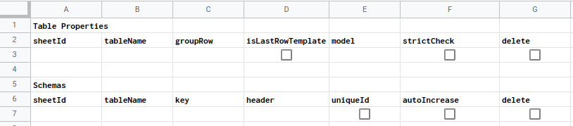

> Reduce and simplify business logic by accessing Google Sheet tables as object models

## Prerequisite

Enable Sheets API from Advanced Google Services

Add schema tables in a sheet



Set Schema tables sheet id in apps script

`CONFIG.SCHEMA_SHEET.sheetId = <schema tables sheet id>`

## Insert Tables (Pending)

```
// Initialize SheetTables by passing a sheet id.
// Sheet id should be of the Sheet where tables need to be inserted
const ST = new SheetTables(1804062973)

ST.insert({
    // table name
    name : "Records",
    headers : ["id", "item", "description", "qty"]
})

ST.insert({
    // table name
    name : "Team",
    headers : ["id", "name", "role" ]
})

```


## Adding data

```
  const models = ST.models
  // add data to table top
  models['Team'].addFirst({ id : 1,  name : "Saad", role : "developer" })
  models['Team'].addLast({ id : 2,  name : "Saad", role : "developer" })

  models['Team'].filter({ id : 2 }).addBelow({ id : 3,  name : "Saad", role : "developer" })
  models['Team'].filter({ id : 2 }).addAbove({ id : 4,  name : "Saad", role : "developer" })

  // add methods also accept multiple row objects for example
  models['Team'].addLast([
    { id : 5,  name : "Saad", role : "developer"} ,
    { id : 6,  name : "Saad", role : "developer"} ,
    { id : 7,  name : "Saad", role : "developer"} 
  ])

  // write to table
  models['Team'].table.commit()

```


## Filtering

```
// set model to point at all values
models['Team'].all()
// get values
let values = models['Team'].value

// filter functions return false if data is not found otherwise returns model object
// values are then accessed with model's 'value' property
models['Team'].filter({ name : "Saad", id : 3 })
values = models['Team'].value

// other filter functions
models['Team'].or({ name : "Saad", id : 3 })
models['Team'].and({ name : "Saad", id : 3 })
models['Team'].not({ name : "Saad", id : 3 })
models['Team'].nand({ name : "Saad", id : 3 }) // NAND logic
models['Team'].nor({ name : "Saad", id : 3 }) // NOR logic
models['Team'].greater({ id : 3 })
models['Team'].less({ id : 3 })

// 'and', 'or', 'not', 'nand' and 'nor' filter functions can also take arrays for example
// the expression below translates to: name = 'Saad' or (id = 3 or id = 4)
models['Team'].or({ name : "Saad", id : [3, 4] })
// similary the expression below translates to: name = 'Saad' and (id = 3 or id = 4)
models['Team'].and({ name : "Saad", id : [3, 4] })

// 'greater' and 'less' functions take a second argument 'equal' of type 'bool'
// to differentiate between operators '>' and '>=' and '<' and '<=' for example
// the below expression translates to: id >= 3
models['Team'].greater({ id : 3 }, true)

```

## Updating
```
// set name to "Khan" for all rows with id greater than 3
models['Team'].greater({ id : 3 }, true).set({ name : "Khan" })
```


## Sorting
```
// by default sort order is ascending
models['Team'].sortBy('id')
// to retrieve sorted values 
let values = models['Team'].value

// to update table
models['Team'].table.commit()

// to sort by order descending
models['Team'].sortBy('id', 'desc')

// to chain sortBy methods
models['Team'].sortBy('id').sortBy('name')

```

## Chaining
```
// Any filter function can be followed by sortBy function
// to sort filtered data for example the expression below will set 'values' to: 
// [
//     { id : 4, name : "Saad", role : "developer" },
//     { id : 3, name : "Saad", role : "developer" }
// ]
values = models['Team'].greater({ id : 3 }, true).sortBy('id', 'desc').value

```

## Join
```
models['Records'].addFirst([
    { id : 3, item : "abc", description : "abc", qty : 1 },
    { id : 4, item : "abc", description : "abc", qty : 1 }
])
let joined = models['Team'].join(models['Records']).on({ t : 'id', r : 'id' })
// the expression above will return a new joined model with values:
// [
//     { "t.id" : 4, "t.name" : "Saad", "t.role" : "developer", "r.id" : 4, "r.item" : "abc", "r.description" : "abc", "r.qty" : 1 },
//     { "t.id" : 3, "t.name" : "Saad", "t.role" : "developer", "r.id" : 3, "r.item" : "abc", "r.description" : "abc", "r.qty" : 1 }
// ]

// to join subset of data filter functions can be used for example the expression below will return 
// a new joined model with values:
// [
//     { "t.id" : 4, "t.name" : "Saad", "t.role" : "developer", "r.id" : 4, "r.item" : "abc", "r.description" : "abc", "r.qty" : 1 },
// ]
models['Records'].filter({ id : 4 })
joined = models['Team'].join(models['Records']).on({ t : 'id', r : 'id' })

```

## API Support
- mapping keys between API and model data
- building json request body from models
- handling json response body and putting into models

### Requests

#### Concept
```
// example request body
{
    ID : 1,
    NameOfPerson : "Saad",
    Role: "developer"
}

// example model data for building request
{
    id : 1,
    name : "Saad",
    role: "developer"
}

// problem: model data cannot be passed as request body because keys are different

// solution: use a directive to map request keys with model keys
{
    ID : "id",
    NameOfPerson : "name",
    Role : "role"
}

// use jsonOut function to get the required request body
jsonOut(directive, models)
```

#### Practical use
```
// updated directive to point to the required model row
let directive = {
    ID : { key : "id", filter : (models) => models["Team"].filter({ id : 1 }) },
    NameOfPerson : "name",
    Role : "role"
}

// any key could have been used to point to the required row
let directive = {
    ID : "id",
    NameOfPerson : { key : "name", filter : (models) => models["Team"].filter({ id : 1 }) },
    Role : "role"
}

// use jsonOut function to get the required request body
let requestBody = jsonOut(directive, models)

// normally request bodies are nested objects
// {
//    ID : 1,
//    NameOfPerson : "Saad",
//    Role : "developer",
//    Data : { Item : "abc", Desc : "abc" } 
// }

// updated directive
directive = {
    ID : { key : "id", filter : (models) => models["Team"].filter({ id : 1 }) },
    NameOfPerson : "name",
    Role : "role",
    Data : { 
        Item : { key : "item", filter : (models) => models["Records"].filter({ id : 1 }) },
        Desc : "description"
    }
}

// request bodies nested object can also be arrays
// {
//    ID : 1,
//    NameOfPerson : "Saad",
//    Role : "developer",
//    Data : [
//        { Item : "abc", Desc : "abc" },
//        { Item : "abc", Desc : "abc" }
//    ]
// }

// udpated directive. note the many attribute in nested directive.
directive = {
    ID : { key : "id", filter : (models) => models["Team"].filter({ id : 1 }) },
    NameOfPerson : "name",
    Role : "role",
    Data : { 
        Item : { key : "item", many : true, filter : (models) => models["Records"].filter({ id : 1 }) },
        Desc : "description"
    }
}

// directives also accept an operation attribute to transform filtered data
directive = {
    ID : { key : "id", filter : (models) => models["Team"].filter({ id : 1 }), operation : (values) => values.forEach(row => row.name += " Khan" ) },
    NameOfPerson : "name",
    Role : "role"
}

// the directive above would produce the output
// {
//     ID : 1,
//     NameOfPerson : "Saad Khan",
//     Role: "developer"
// }
// 
// from the input. Note the transformed value of "NameOfPerson" above
// {
//     id : 1,
//     name : "Saad",
//     role : "developer"
// }

```
### Responses
#### Concept
```
// example response body
{
    ID : 1,
    NameOfPerson : "Saad",
    Role: "developer"
}

// problem: a model can throw an error on trying to add this object because of keys mismatching

// solution: use a directive to map request keys with model keys
{
    ID : "id",
    NameOfPerson : "name",
    Role : "role"
}

// use jsonIn function to insert the response body
jsonIn(directive, models, response)
```
#### Practical use
```
// updated directive to point to the required model
let directive = {
    ID : { key : "id", model : "Team" },
    NameOfPerson : "name",
    Role : "developer"
}

// any key could have been used to point to the required model
directive = {
    ID : "id",
    NameOfPerson : { key : "name", model : "Team" },
    Role : "role"
}

// normally response bodies are nested objects
let response = {
    ID : 1,
    NameOfPerson : "Saad",
    Role : "developer",
    Data : { Item : "abc", Desc : "abc" } 
}

// updated directive
directive = {
    ID : { key : "id", model : "Team" },
    NameOfPerson : "name",
    Role : "developer",
    Data : {
        Item : { key : "item", model : "Records" },
        Desc : "description"
    }
}

// use jsonIn function to insert the response body
jsonIn(directive, models, response)

// response bodies nested object can also be arrays
response = {
   ID : 1,
   NameOfPerson : "Saad",
   Role : "developer",
   Data : [
       { Item : "abc", Desc : "abc" },
       { Item : "abc", Desc : "abc" }
   ]
}

// updated directive. note the many attribute in nested directive.
directive = {
    ID : { key : "id", model : "Team" },
    NameOfPerson : "name",
    Role : "developer",
    Data : {
        Item : { key : "item", model : "Records", many : true },
        Desc : "description"
    }
}

// directives also accept an operation attribute to transform response bodies
directive = {
    ID : { key : "id", model : "Team", operation : (obj) => obj.Data.forEach(item => item.id = obj.ID) },
    NameOfPerson : "name",
    Role : "role"
    Data : {
        id : { key : "id", model : "Records" },
        Desc : "description",
        Item : "item"
    }
}

// the directive above would transform the response from
// {
//    ID : 1,
//    NameOfPerson : "Saad",
//    Role : "developer",
//    Data : [
//        { Item : "abc", Desc : "abc" },
//        { Item : "abc", Desc : "abc" }
//    ]
// }
//
// to below. Note the id key added to the nested object
// {
//    ID : 1,
//    NameOfPerson : "Saad",
//    Role : "developer",
//    Data : [
//        { id : 1, Item : "abc", Desc : "abc" },
//        { id : 1, Item : "abc", Desc : "abc" }
//    ]
// }
```